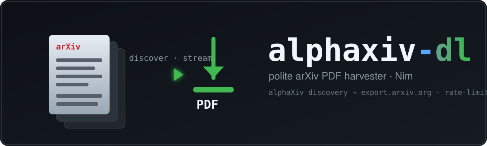
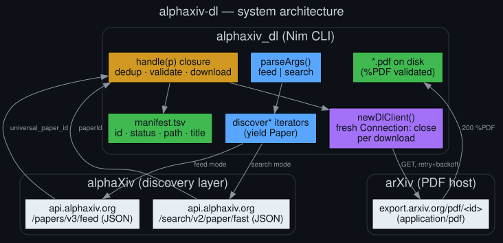

<p align="center">
  
</p>

<h1 align="center">alphaxiv-dl</h1>

<p align="center">
  
  
  
  
  <br>
  
  
  
  
</p>

A polite, paginating **crawler + PDF downloader** for **alphaXiv** / **arXiv**, written in Nim.

---

## What it is

[alphaXiv](https://www.alphaxiv.org) is a discussion layer **on top of** arXiv — it
hosts no original PDFs; every paper id is an arXiv id. `alphaxiv-dl`:

1. **Discovers** arXiv paper ids via alphaXiv's JSON API (paginated **feed** or **search**), then
2. **Downloads** the PDFs from arXiv's automation host (`export.arxiv.org/pdf`).

Downloads **stream** — each paper is fetched the moment it's discovered, so PDFs
start landing on page 1 instead of after the whole feed is crawled.

<p align="center">
  
</p>

## Why it's careful

It's deliberately considerate of two free services:

- one shared client, **rate-limited** (`--delay`, default 3s between requests)
- **exponential backoff** on `429` / `503` / truncated reads
- descriptive **User-Agent** (put your contact email in it via `--ua`)
- **resumes / skips** existing valid files
- validates every download actually begins with `%PDF`
- writes an auditable **`manifest.tsv`** (id · status · path · title)

> For **large-scale** full-text harvesting, arXiv asks you to use its
> [bulk dataset (S3/Kaggle)](https://info.arxiv.org/help/bulk_data.html) instead.
> This tool is for modest, polite use. Respect alphaXiv's and arXiv's Terms of Use.

## Build

```bash
nim c -d:release -d:ssl alphaxiv_dl.nim    # needs OpenSSL at runtime
```

Compatible with Nim 1.6.x and 2.2.x. A prebuilt Linux x86-64 binary (`alphaxiv_dl`)
is included in this repo for convenience.

## Usage

```bash
alphaxiv_dl feed   [options]
alphaxiv_dl search "your query" [options]
```

| Option | Default | Notes |
|--------|---------|-------|
| `-o, --out DIR` | `./alphaxiv_pdfs` | output dir (relative to **cwd**) |
| `-n, --max N` | unlimited | stop after N downloads (ok + skipped) |
| `--pages N` | 1 | feed pages to crawl |
| `--start-page N` | 1 | first feed page |
| `--page-size N` | 20 | results per feed page |
| `--sort S` | Hot | `Hot \| Comments \| Views \| Likes \| GitHub \| Recommended \| Recent` |
| `--interval W` | 7d | `3d \| 7d \| 30d \| 90d \| all` (mapped to API's `"7 Days"` etc.) |
| `--delay SECS` | 3 | delay between requests |
| `--retries N` | 4 | retries on errors (exponential backoff) |
| `--dry-run` | | list ids/titles; download nothing |
| `--ids-only` | | print discovered arXiv ids only (one per line) |
| `--ua STRING` | | override User-Agent — **put your contact email in it** |
| `-v` / `-h` | | verbose / help |

### Examples

```bash
# crawl 30 feed pages, stop after 250 PDFs, stream into ./pdfs
alphaxiv_dl feed --pages 30 --page-size 20 -o ./pdfs -n 250

# search and grab the top 10 into ./cot
alphaxiv_dl search "chain of thought reasoning" -n 10 -o ./cot

# preview only — no downloads
alphaxiv_dl feed --pages 2 --dry-run

# just the ids, for piping
alphaxiv_dl search "diffusion models" --ids-only
```

## How it works

See [HOWTO.md](HOWTO.md) for a task-oriented walkthrough, and
[diagrams/](diagrams/) for the full visual set (architecture, data-flow,
network, operator visibility, roadmap).

### Parallel fork

[`fork/`](fork/) holds a **throttled-parallel** variant (v1.2): a bounded worker
pool with a *global* request-spacing throttle, compile-time tunables, an
`.nimble` package, and a **resumable, host-failover downloader** (curl-backed
Range-resume, falling back to `arxiv.org` and to Nim `std/httpclient`). It exists
because `export.arxiv.org` currently truncates large PDFs mid-stream — see
[fork/README.md](fork/README.md) for the full debug write-up.

## API specifics (verified 2026-06-11)

- **Feed:** `GET api.alphaxiv.org/papers/v3/feed?pageNum=&pageSize=&sort=&interval=`
  - `interval` must be spelled out: `3 Days | 7 Days | 30 Days | 90 Days | All time`
    (the CLI shorthands are translated internally by `apiInterval`).
  - `sort`: `Hot | Comments | Views | Likes | GitHub | Recommended | Recent`.
  - the arXiv id is in the `universal_paper_id` field (top-level `id` is a UUID).
- **Search:** `GET api.alphaxiv.org/search/v2/paper/fast?q=&includePrivate=false`
  returns a JSON array; the arXiv id is in `paperId`.

## Engineering notes (three bugs worth remembering)

This tool was hardened against three real failure modes (full write-up in
[SESSION.md](SESSION.md)):

1. **Feed returns HTTP 400 → "no papers discovered."** alphaXiv changed the feed
   `interval` schema; `7d`-style shorthands are rejected. Fixed by mapping them to
   `"7 Days"` etc. via `apiInterval`.
2. **"Looks idle, no PDFs" with many `--pages`.** Discovery and download used to be
   two strict phases (crawl *all* pages first). Now discovery is an **iterator** and
   downloads **stream** as papers are found.
3. **`Received length doesn't match expected length` on large PDFs.** Not a Nim type
   error — `std/httpclient` detecting a **truncated body** from a reused keep-alive
   TLS socket. Fixed with a **fresh `Connection: close` client per download attempt**.
   Debug tell: `curl` pulls the full `Content-Length` fine while the program fails →
   the fault is client-side keep-alive reuse.

## License

[MIT](LICENSE) © 2026 danindiana
